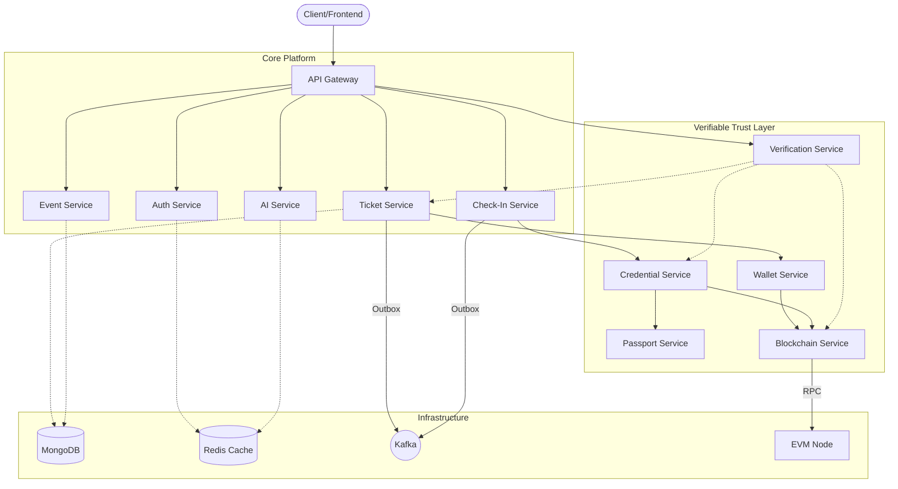

# EventOne - Final Engineering Report

## 1. Complete Architecture
EventOne is a distributed, event-driven Spring Boot microservices platform tailored for high-availability ticketing and verifiable reputation.

## 2. Database Architecture
MongoDB serves as the central application source of truth. Multi-document state updates are strictly decoupled using the Outbox pattern.
- `Event`: Stores metadata, capacity, and price constraints.
- `Ticket`: Bound securely to a specific `eventId` and `userId`.
- `OutboxEvent`: A generic collection persisting state transitions before they are shipped to Kafka.
- `Passport`: A read-optimized projection of historical checkpoints and awards.
- `ReconciliationRecord`: Tracks discrepancies between DB and EVM state.

## 3. Kafka Architecture
Kafka provides at-least-once delivery semantics to decouple synchronous bottlenecks from ticket generation.
- **Topics**: `ticket-events`, `checkin-events`, `credential-events`.
- **Consumers**: Services like `blockchain-service` subscribe using Spring Kafka.
- **Idempotency**: All consumers assert `isEventProcessed()` via Redis or MongoDB to survive duplicated delivery safely.
- **DLQ**: Unprocessable messages (e.g., malformed payloads) are routed to Dead Letter Queues after retries exhaust, ensuring main topics aren't blocked.

## 4. Blockchain Architecture
EventOne bridges Web2 convenience with Web3 verifiability. 
- **Web3j**: The `blockchain-service` acts as the exclusive EVM interface (protecting private keys).
- **EventOneTicket.sol**: Mints NFT-based tickets asserting ownership.
- **EventOneCredential.sol**: Non-transferable proofs-of-attendance dynamically issued upon check-in.
- **Reconciliation**: `verification-service` routinely audits EVM tokens against MongoDB documents, explicitly declaring mismatches without mutating the immutable ledger.

## 5. Security
- **Auth**: RBAC enforced via short-lived JWTs (`ATTENDEE`, `ORGANIZER`, `SCANNER`).
- **Dynamic QR**: Short-TTL (e.g., 60 seconds), cryptographically signed payloads prevent replay attacks.
- **Wallet**: Users sign challenges offline; the backend verifies ECRecover to confirm true ownership before minting tickets to a wallet.
- **AI Constraints**: Minimal context provisioning blocks prompt-injection leakage of PII.

## 6. Reliability
- **Outbox Pattern**: Fixes dual-write scenarios. When a check-in occurs, the `Ticket` updates and an `OutboxEvent` creates atomically in one Mongo transaction.
- **Fallback Chains**: If the Blockchain RPC is down, `verification-service` degrades gracefully, indicating `BLOCKCHAIN_UNAVAILABLE` rather than throwing a fatal 500 error, allowing standard ticketing to remain operable.

## 7. AI 
- **Grounding Layer**: To prevent hallucinations, the LLM translates queries ("AI events under 500") into structured `EventSearchIntent` filters.
- **Candidate Validation**: `EventServiceClient` fetches deterministic candidates, which the LLM ranks. Crucially, the `ServerSideValidator` drops any `eventId` the LLM generates that was *not* provided in the bounded backend list. 
- **Privacy**: The LLM is strictly shielded from reading DB IDs, PII, or security contexts.

## 8. Testing
- **E2E / Integration**: The platform features exhaustive Spring Boot `@SpringBootTest` architectures (using Testcontainers for Mongo/Redis).
- **Anti-Hallucination**: Specific test vectors (e.g., `testAntiHallucinationValidatorStrikesFakeEvents`) verify the validation logic drops manually injected fake identifiers.
- **Race Condition Immunity**: Check-ins simulate massive throughput, utilizing MongoDB native atomic `$set` operations ensuring exact-once status transitions.

## 9. DevOps
- **Docker Compose**: One unified `docker-compose.yml` spins up MongoDB, Redis, Kafka, Zookeeper, and the 9 Spring Boot microservices natively.
- **Configuration**: Managed strictly via `.env` files preventing secret commits.
- **Maven**: Multi-module `pom.xml` provides cohesive CI compilation.

---

## 10. Hackathon Demo Script (3-5 Minutes)

**Step 1. Discovery (AI Grounding)**
- *Action*: Prompt the AI Service: "Find me an AI event this weekend under ₹500."
- *Result*: The system returns valid events. 
- *Challenge*: Ask the AI for an event that doesn't exist.
- *Result*: "No matching EventOne events found" (Proving anti-hallucination).

**Step 2. Ticket Issuance (Resilience)**
- *Action*: Purchase a ticket.
- *Result*: Ticket appears in MongoDB instantly. Kafka asynchronously instructs the Blockchain service to mint it.

**Step 3. Check-In (QR Security)**
- *Action*: Generate a Dynamic QR and scan it.
- *Result*: Check-in registers as `SUCCESS`.
- *Challenge*: Scan the exact same QR again.
- *Result*: `ALREADY_USED` rejection.

**Step 4. Proof of Attendance (Trust Layer)**
- *Action*: Upon check-in, observe the `credential-service` issuing a non-transferable EVM credential.
- *Result*: User's Passport Dashboard updates their reputation score globally.

**Step 5. Public Verification (Reconciliation)**
- *Action*: Open the public API endpoint for the newly generated Ticket.
- *Result*: System shows `VERIFIED` (Mongo matches EVM).
- *Challenge*: Disconnect the EVM node (kill RPC).
- *Result*: System degrades to `BLOCKCHAIN_UNAVAILABLE` but still successfully verifies Mongo state, proving architectural resilience.

---

## 11. Architecture Decisions

> **PROPOSED DECISION**: Microservice Monorepo Topology
> *Reason*: To allow teams to develop services independently while sharing core DTOs in a Hackathon timeframe.
> *Trade-off*: Slower initial compile times, but vastly simpler CI tracking than separate repositories.

> **PROPOSED DECISION**: Outbox Pattern via Spring Data MongoDB
> *Reason*: Kafka cannot participate in standard DB transactions. Using a MongoDB Outbox collection ensures we never issue a check-in event without first committing the ticket state.
> *Trade-off*: Requires a background polling scheduler to dispatch outbox events.

> **PROPOSED DECISION**: AI Server-Side Validation
> *Reason*: LLMs will eventually hallucinate. 
> *Trade-off*: We sacrifice the ability for the LLM to invent its own responses entirely, but we guarantee 100% data integrity for EventOne users.

> **PROPOSED DECISION**: Standalone Verification Service
> *Reason*: Prevents public QR scanners from directly DDOSing the internal Ticket/Blockchain databases.
> *Trade-off*: Requires internal proxying and Redis caching to manage lookup latency.
