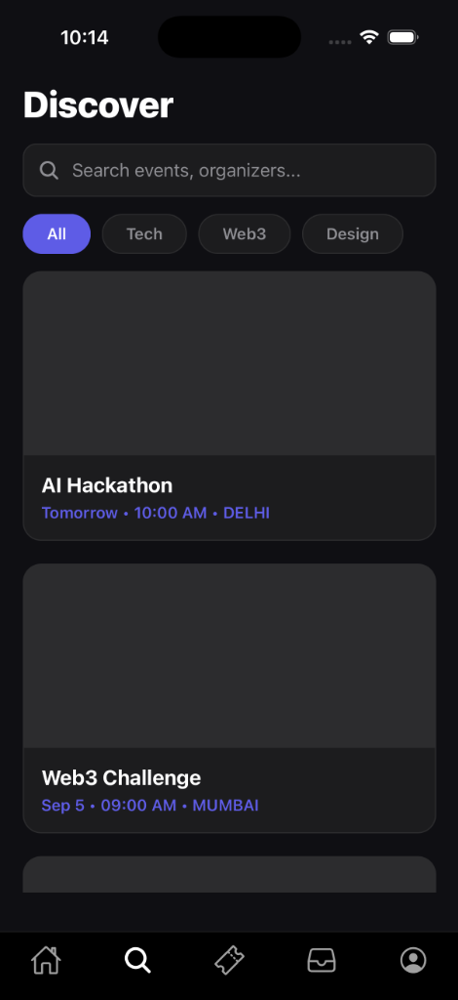
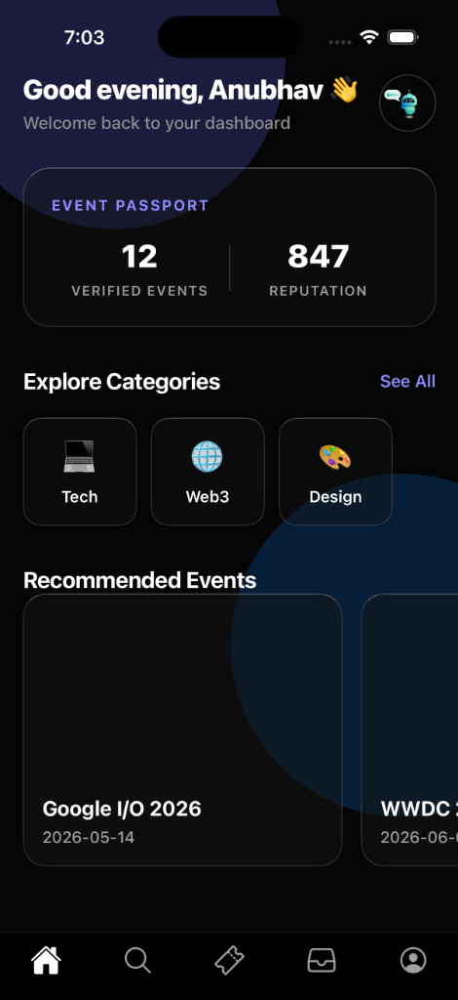
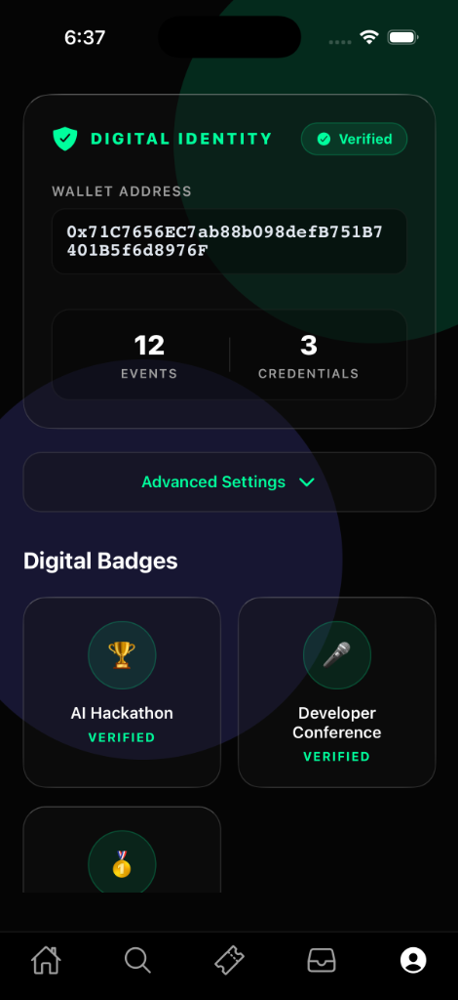
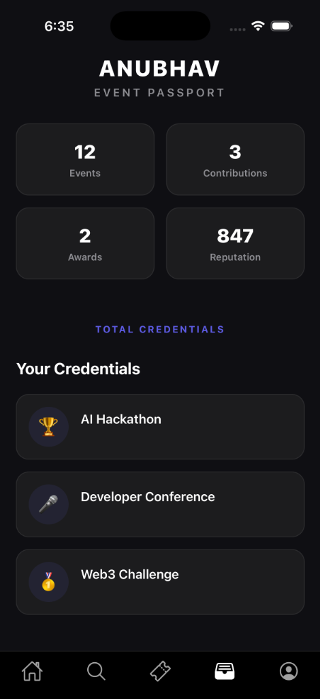
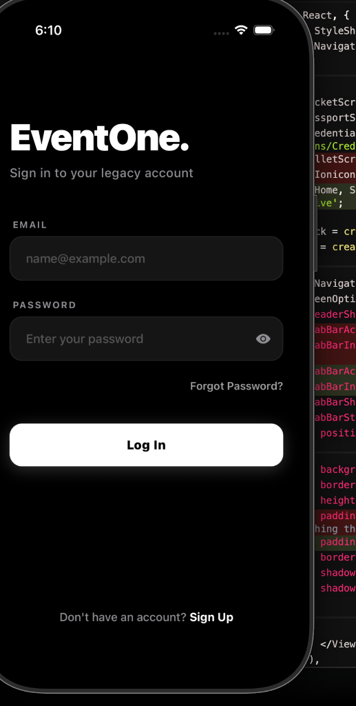

<div align="center">
  
  # 🌌 EventOne
  
  **The Next-Generation Web3 Event & Ticketing Platform**
  
  [](#)
  [](#)
  [](#)
  
  A hyper-realistic glassmorphism mobile application for discovering, managing, and showcasing digital event credentials on-chain.
  
</div>

---

## ✨ About The Project

**EventOne** redefines how users interact with IRL and virtual tech events. Built from the ground up with a stealthy, OLED-optimized matte black canvas, the app leverages deep native blur rendering to create stunning frosted glass cards that react realistically to directional light. 

From zero-knowledge digital identity wallets to perfectly looped Lottie animations, EventOne provides a hyper-premium, agency-level user experience for modern developers and Web3 enthusiasts.

## 🚀 Key Features

- 💎 **Premium Glassmorphism**: Authentic frosted glass cards with directional specular highlights and ambient glowing orbs.
- ⛓️ **Web3 Digital Identity**: Natively connect your wallet, view your Ethereum address, and manage on-chain badges.
- 🎬 **Hardware-Accelerated Lottie**: Smooth `.json` animations customized dynamically via React Native `colorFilters`.
- 🌑 **OLED Matte Black**: A true `#000000` canvas designed to save battery and make content pop.
- 🎟️ **Dynamic Passport System**: Track your verified events, contributions, awards, and reputation seamlessly.

---

## 📱 UI Showcase

### Discover & Dashboard
Browse curated tech conferences with high-resolution artwork floating beneath translucent UI elements.

| Discover Events | Home Dashboard |
| :---: | :---: |
|  |  |

### Identity & Credentials
View verified credentials, wallet balances, and your personal event passport.

| Web3 Wallet Identity | Event Passport |
| :---: | :---: |
|  |  |

### Authentication
A beautiful, highly-responsive legacy black login flow using premium typography and strict monochrome contrast.

<div align="center">
  
</div>

---

## 🛠️ Tech Stack

**Frontend & Core:**
- **React Native**: Core mobile framework.
- **Expo**: Accelerated development and native bundling.
- **React Navigation**: Complex bottom tab and nested native stack routing.

**UI & Animations:**
- **`expo-blur`**: Native iOS/Android blurred frosted glass rendering.
- **`expo-linear-gradient`**: Multi-stop specular highlights and gradients.
- **`lottie-react-native`**: Dynamic vector animations.
- **Animated API**: Custom layout transitions and tactile button responses.

**Architecture:**
- **Express.js**: Custom mock server and REST API for local event delivery.
- **Context API**: Global state management and authentication flow.

---

## ⚙️ Getting Started

To get a local copy up and running, follow these simple steps.

### Prerequisites
- Node.js installed
- Expo Go app on your physical device (or iOS/Android simulator)

### Installation
1. Clone the repo:
   ```bash
   git clone https://github.com/param20h/EventOne.git
   ```
2. Install dependencies:
   ```bash
   npm install
   ```
3. Start the Expo development server:
   ```bash
   npx expo start
   ```

---

## 👨‍💻 Meet The Team

This project was crafted by a dedicated team of developers and designers:

*   **Param** - [@param20h](https://github.com/param20h)
*   **Afzal** - [@AFZAL-CL](https://github.com/AFZAL-CL)
*   **Anubhav** - [@anubhavxdev](https://github.com/anubhavxdev)

---

## 📄 License

Distributed under the MIT License. See `LICENSE` for more information.
